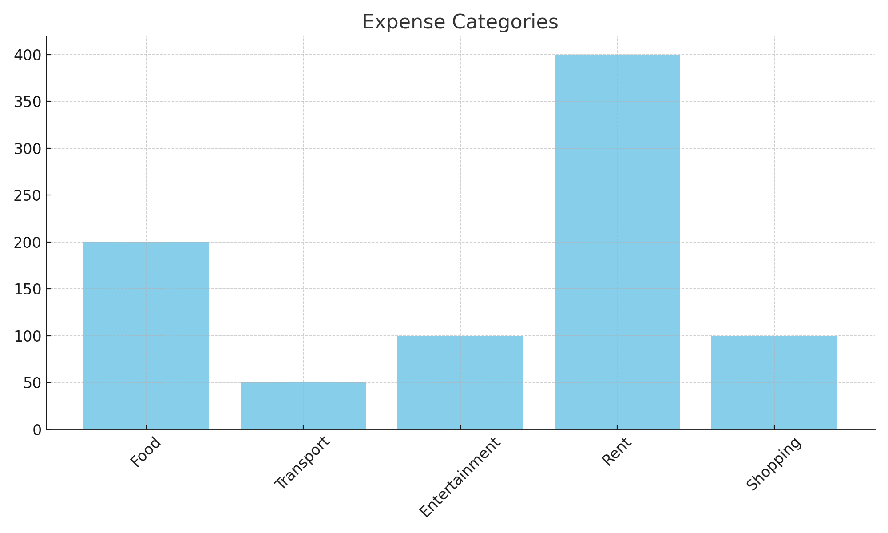

# 💰 Advanced Personal Finance Advisor

A Streamlit app to manage and visualize your monthly income, expenses, and savings with smart recommendations.

## 🔐 Login
- **Username**: admin
- **Password**: pass123

## 💡 Features
- User login/auth
- Upload or use sample CSV
- Monthly summary & savings rate
- Pie chart of expense categories
- Smart budgeting recommendations

## 🚀 Run It Locally

```bash
pip install -r requirements.txt
streamlit run app.py
```

## 📷 Screenshots

